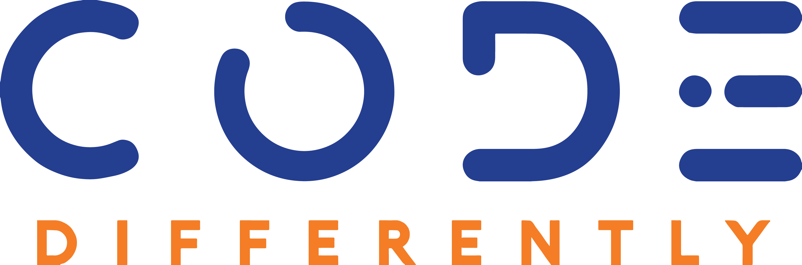

## HTML Basics Lab

- Using the newly acquired knowledge you will build an *About Me* web page using HTML.

### The Set-Up

- Create a repository and call it  <em>“html-basics”</em> 

- Initialize the repository

- Clone locally and open repository in Visual Studio Code

- Create an HTML file called `index.html`

- Push up your changes to the remote repository

### The Task

Your *About Me* web page must include the following:

1. Navigation bar to navigate to different sections in the web page. 

    - Sections needed are:

        - About
        - Accomplishments
        - Skills
        - Hobbies/Interest
        - Contact (do not include any phone numbers or addresses)

2. An image of you. Must be professional. 

3. Banner with your name

4. Content in the sections above

5. Mandatory elements:

- `<header>`
- `<footer>`
- `<section>`
- `<article>`

6. Must have the global document structure

7. Must be version controlled